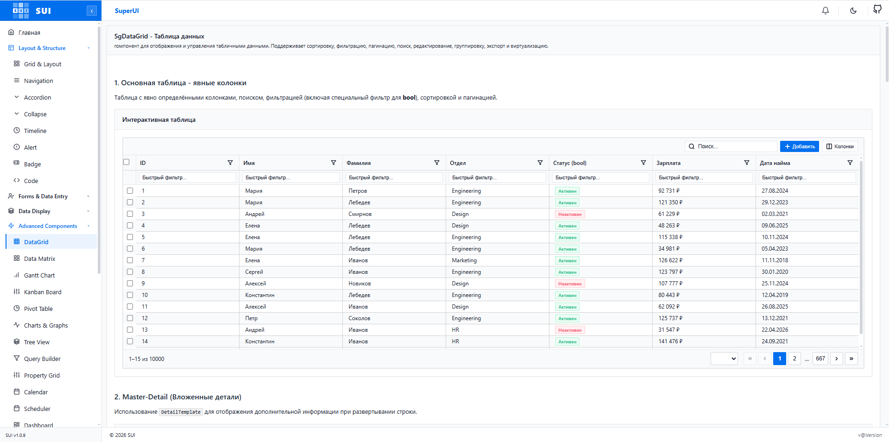
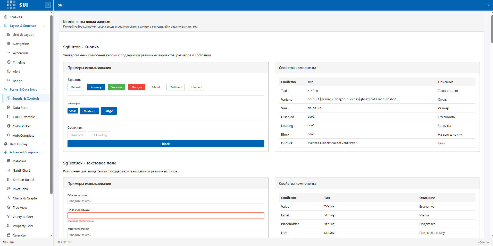

# SuperUI

<p align="center">
  
</p>

[](https://www.nuget.org/packages/SuperUI)
[](https://www.nuget.org/packages/SuperUI)
[](https://github.com/Maxvalpav/SuperUI.Blazor/actions/workflows/build-and-publish.yml)
[](https://Maxvalpav.github.io/SuperUI.Blazor/)
[](LICENSE)

**SuperUI** — Blazor component library with 25+ components: advanced data grid, forms, overlays, navigation, layout, charts. Full IntelliSense, dark mode, localization (en-US, ru-RU)

🔗 **Live demo:** <https://maxvalpav.github.io/SuperUI.Blazor/>
📦 **NuGet:** <https://www.nuget.org/packages/SuperUI>




---

## ✨ Features

- 🧩 **25+ components** — grid, forms, dialogs, drawer, tabs, calendar, charts, kanban, tree, timeline, etc.
- 🎨 **Theming** — light/dark mode, CSS-variables, full design-token customization
- 🌍 **Localization** — en-US, ru-RU out of the box, easily extendable
- ⚡ **High performance** — virtualization, low allocations on hot paths
- 🛠 **IntelliSense** — full XML-doc for parameters, embedded source symbols
- 🌐 **Blazor WASM + Server + Hybrid** — all hosting models supported

## 📦 Installation

```bash
dotnet add package SuperUI
```

Requires **.NET 10** (`net10.0`).

---

## 🚀 Setup per hosting model

SuperUI works the same way across all Blazor hosting models — only the location of `Program.cs` and the host file (`index.html` vs `App.razor`/`_Host.cshtml`) differs.

### 🟢 Common steps (all models)

**1.** `_Imports.razor`:

```razor
@using SuperUI
@using SuperUI.Components
@using SuperUI.Services
```

**2.** Add a single host component anywhere inside `MainLayout.razor` (required for toasts, dialogs, drawers, popovers, theme):

```razor
@inherits LayoutComponentBase

<SgThemeProvider>
    <SgToastHost />
    <SgConfirmHost />
    <SgPortalHost />

    <main>
        @Body
    </main>
</SgThemeProvider>
```

---

### 🌐 Blazor WebAssembly (standalone)

`Program.cs`:

```csharp
using Microsoft.AspNetCore.Components.Web;
using Microsoft.AspNetCore.Components.WebAssembly.Hosting;
using SuperUI;

var builder = WebAssemblyHostBuilder.CreateDefault(args);
builder.RootComponents.Add<App>("#app");
builder.RootComponents.Add<HeadOutlet>("head::after");

builder.Services.AddSuperUI();

await builder.Build().RunAsync();
```

`wwwroot/index.html` — add CSS in `<head>` (Chart.js scripts only if you use `SgChart`):

```html
<head>
    <base href="/" />
    <link rel="stylesheet" href="_content/SuperUI/superui-theme.css" />
    <link rel="stylesheet" href="_content/SuperUI/superui-components.css" />

    <!-- optional: only if you use SgChart -->
    <script src="https://cdn.jsdelivr.net/npm/chart.js@4.4.0/dist/chart.umd.min.js"></script>
    <script src="https://cdn.jsdelivr.net/npm/chartjs-plugin-zoom@2.1.0/dist/chartjs-plugin-zoom.min.js"></script>
    <script src="https://cdn.jsdelivr.net/npm/chartjs-chart-matrix@1.1.1/dist/chartjs-chart-matrix.min.js"></script>
</head>
<body>
    <div id="app">Loading…</div>
    <script src="_framework/blazor.webassembly.js"></script>
</body>
```

> **Note.** All SuperUI JS is auto-loaded as `JSImport` modules from `_content/SuperUI/...` — no extra `<script>` tags are needed for the library itself.

---

### 🟦 Blazor Server (ASP.NET Core 10)

`Program.cs`:

```csharp
using SuperUI;

var builder = WebApplication.CreateBuilder(args);

builder.Services.AddRazorComponents()
    .AddInteractiveServerComponents();

builder.Services.AddSuperUI();          // ← register SuperUI

var app = builder.Build();
app.UseStaticFiles();
app.UseAntiforgery();
app.MapRazorComponents<App>()
    .AddInteractiveServerRenderMode();

app.Run();
```

`Components/App.razor` — CSS goes in `<head>`:

```razor
<!DOCTYPE html>
<html lang="en">
<head>
    <meta charset="utf-8" />
    <meta name="viewport" content="width=device-width, initial-scale=1.0" />
    <base href="/" />
    <link rel="stylesheet" href="@Assets["_content/SuperUI/superui-theme.css"]" />
    <link rel="stylesheet" href="@Assets["_content/SuperUI/superui-components.css"]" />
    <HeadOutlet />
</head>
<body>
    <Routes />
    <script src="_framework/blazor.web.js"></script>
</body>
</html>
```

> **Interactivity.** SuperUI components require an interactive render mode. Either set it globally in `App.razor`:
>
> ```razor
> <Routes @rendermode="InteractiveServer" />
> ```
> or per page with `@rendermode InteractiveServer`.

---

### 🟪 Blazor Web App — Auto / WebAssembly / Server (.NET 10 unified)

For the **Blazor Web App** template (the default in .NET 8+), call `AddSuperUI()` in **both** projects so the services are available on both the server pre-render and the WASM client:

`Server/Program.cs`:

```csharp
builder.Services.AddRazorComponents()
    .AddInteractiveServerComponents()
    .AddInteractiveWebAssemblyComponents();

builder.Services.AddSuperUI();
```

`Client/Program.cs`:

```csharp
builder.Services.AddSuperUI();
```

Then choose the render mode per page (`@rendermode InteractiveAuto`, `InteractiveWebAssembly`, or `InteractiveServer`).

---

### 📱 Blazor Hybrid (MAUI / WPF / WinForms)

```csharp
// MauiProgram.cs
builder.Services.AddMauiBlazorWebView();
builder.Services.AddSuperUI();
```

`wwwroot/index.html` — same CSS links as in WebAssembly.

---

## ⚙️ Configuration

```csharp
builder.Services.AddSuperUI(options =>
{
    options.DefaultTheme   = "dark";        // "light" | "dark" | "auto"
    options.DefaultCulture = "ru-RU";       // "en-US" | "ru-RU"
    options.ToastPosition  = ToastPosition.TopRight;
    options.ZIndexBase     = 2000;
});
```

---

## 🎨 Quick start

```razor
@page "/"
@inject SgToastService Toast

<SgCard Title="User profile">
    <SgGrid TItem="User" Items="@users" Pageable Sortable Filterable>
        <SgGridColumn TItem="User" Field="@nameof(User.Name)"  Title="Name" />
        <SgGridColumn TItem="User" Field="@nameof(User.Email)" Title="Email" />
    </SgGrid>

    <SgButton Variant="ButtonVariant.Primary" OnClick="@Save">Save</SgButton>
</SgCard>

@code {
    List<User> users = new();
    void Save() => Toast.Show("Saved!", ToastSeverity.Success);
}
```

---

## 🧱 Component groups

| Group | Components |
|-------|-----------|
| **Data**       | SgGrid, SgTreeGrid, SgKanban, SgPivotTable, SgTimeline, SgGantt |
| **Forms**      | SgTextBox, SgComboBox, SgAutoComplete, SgDatePicker, SgColorPicker, SgFileUpload, SgRichTextEditor |
| **Overlays**   | SgDialog, SgDrawer, SgPopover, SgToast, SgConfirm, SgContextMenu, SgWindow |
| **Navigation** | SgTabs, SgMenu, SgBreadcrumb, SgStepper, SgPagination |
| **Layout**     | SgRow, SgCol, SgCard, SgSplitter, SgAccordion |
| **Charts**     | SgChart (line/bar/area/pie/scatter/heatmap/matrix) |
| **Feedback**   | SgAlert, SgBadge, SgProgressBar, SgSkeleton, SgSpinner |


---

## 📸 Screenshots

Screenshots live in [`docs/screenshots/`](docs/screenshots/) and are referenced from this README and the demo site.

<table>
  <tr>
    <td></td>
    <td></td>
  </tr>
</table>


---

## 🛠 Build from source

```bash
git clone https://github.com/Maxvalpav/SuperUI.git
cd SuperUI
dotnet restore
dotnet build -c Release
dotnet run --project SuperUI.Demo
```

Requires **.NET 10 SDK**.

## 🧪 Tests

```bash
dotnet test
```

## 📄 License

[MIT](LICENSE) © 2026 SuperUI Contributors

## 🤝 Contributing

Issues and pull requests welcome. Please follow conventional commits and run `dotnet test` before submitting.

---

## 🇷🇺 Русский

**SuperUI** — библиотека Blazor-компонентов: 25+ компонентов, тёмная тема, локализация (en-US, ru-RU).

### Установка

```bash
dotnet add package SuperUI
```

### Подключение

**Blazor WebAssembly** (`Program.cs`):

```csharp
using SuperUI;
builder.Services.AddSuperUI();
```

**Blazor Server** (`Program.cs`):

```csharp
using SuperUI;
builder.Services.AddRazorComponents().AddInteractiveServerComponents();
builder.Services.AddSuperUI();
```

**Blazor Web App** (.NET 10) — вызвать `AddSuperUI()` **и в Server, и в Client** проектах.

В `_Imports.razor`:

```razor
@using SuperUI
@using SuperUI.Components
```

В `<head>` хост-страницы (`index.html` для WASM, `App.razor` для Server):

```html
<link rel="stylesheet" href="_content/SuperUI/superui-theme.css" />
<link rel="stylesheet" href="_content/SuperUI/superui-components.css" />
```

В `MainLayout.razor` обернуть приложение в host-компоненты:

```razor
<SgThemeProvider>
    <SgToastHost />
    <SgConfirmHost />
    <SgPortalHost />
    @Body
</SgThemeProvider>
```


- **Демо:** <https://maxvalpav.github.io/SuperUI.Blazor/>
- **NuGet:** `dotnet add package SuperUI`
- **Лицензия:** MIT
- **Контакты:** telegram: @maksimov8val , email: maksimov.val@rambler.ru
