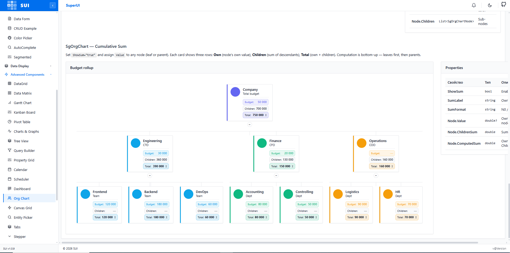

# SuperUI

<p align="center">
  
</p>

[](https://www.nuget.org/packages/SuperUI)
[](https://www.nuget.org/packages/SuperUI)
[](https://github.com/Maxvalpav/SuperUI.Blazor/actions/workflows/build-and-publish.yml)
[](https://Maxvalpav.github.io/SuperUI.Blazor/)
[](LICENSE)

**SuperUI** — Blazor component library with 90+ components: advanced data grid, canvas grid, forms, overlays, navigation, layout, charts, kanban, gantt, pivot table, org chart, scheduler, diagram editor, and more. Full IntelliSense, dark mode, localization (en-US, ru-RU).

🔗 **Live demo:** <https://maxvalpav.github.io/SuperUI.Blazor/>  
📦 **NuGet:** <https://www.nuget.org/packages/SuperUI>


---

## ✨ Features

- 🧩 **90+ components** — data grid, canvas grid, forms, dialogs, drawer, tabs, calendar, charts, kanban, gantt, pivot table, org chart, scheduler, diagram editor, tree view, timeline, and more
- 🎨 **Theming** — light/dark mode, CSS variables, full design-token customization, built-in theme editor
- 🌍 **Localization** — en-US, ru-RU out of the box, easily extendable via `ISuperUILocalizer`


---

## 📦 Installation

```bash
dotnet add package SuperUI
```

Requires **.NET 10** (`net10.0`).

---

## 🚀 Setup

### Common steps (all hosting models)

**1. `_Imports.razor`:**

```razor
@using SuperUI
@using SuperUI.Components
```

**2. CSS in the host page** (`wwwroot/index.html` for WASM, `App.razor` for Server/Web App):

```html
<link rel="stylesheet" href="_content/SuperUI/superui-theme.css" />
<link rel="stylesheet" href="_content/SuperUI/superui-components.css" />
```

**3. Host components in `MainLayout.razor`** (required for toasts, confirm dialogs, popovers, portals):

```razor
@inherits LayoutComponentBase

<SgThemeProvider>
    <SgToastHost />
    <SgConfirmHost />
    <SgPortalHost />
    <main>@Body</main>
</SgThemeProvider>
```

---

### 🌐 Blazor WebAssembly

`Program.cs`:

```csharp
using SuperUI;

var builder = WebAssemblyHostBuilder.CreateDefault(args);
builder.Services.AddSuperUI();
await builder.Build().RunAsync();
```

`wwwroot/index.html`:

```html
<head>
    <link rel="stylesheet" href="_content/SuperUI/superui-theme.css" />
    <link rel="stylesheet" href="_content/SuperUI/superui-components.css" />
    <!-- optional: only if you use SgChart -->
    <script src="https://cdn.jsdelivr.net/npm/chart.js@4.4.0/dist/chart.umd.min.js"></script>
    <script src="https://cdn.jsdelivr.net/npm/chartjs-plugin-zoom@2.1.0/dist/chartjs-plugin-zoom.min.js"></script>
    <script src="https://cdn.jsdelivr.net/npm/chartjs-chart-matrix@1.1.1/dist/chartjs-chart-matrix.min.js"></script>
</head>
```

> All SuperUI JS is loaded as ES modules from `_content/SuperUI/` — no extra `<script>` tags needed.

---

### 🟦 Blazor Server

`Program.cs`:

```csharp
using SuperUI;

builder.Services.AddRazorComponents()
    .AddInteractiveServerComponents();
builder.Services.AddSuperUI();
```

`App.razor`:

```razor
<link rel="stylesheet" href="@Assets["_content/SuperUI/superui-theme.css"]" />
<link rel="stylesheet" href="@Assets["_content/SuperUI/superui-components.css"]" />
```

> Components require an interactive render mode. Set globally: `<Routes @rendermode="InteractiveServer" />` or per page with `@rendermode InteractiveServer`.

---

### 🟪 Blazor Web App (Auto / WASM / Server)

Call `AddSuperUI()` in **both** server and client projects:

```csharp
// Server/Program.cs
builder.Services.AddRazorComponents()
    .AddInteractiveServerComponents()
    .AddInteractiveWebAssemblyComponents();
builder.Services.AddSuperUI();

// Client/Program.cs
builder.Services.AddSuperUI();
```

---

### 📱 Blazor Hybrid (MAUI / WPF / WinForms)

```csharp
// MauiProgram.cs
builder.Services.AddMauiBlazorWebView();
builder.Services.AddSuperUI();
```

---

## ⚙️ Configuration

```csharp
builder.Services.AddSuperUI(options =>
{
    options.DefaultTheme          = "dark";       // "light" | "dark" | "auto"
    options.DefaultCulture        = "ru-RU";      // "en-US" | "ru-RU"
    options.DefaultToastDurationMs = 4000;
});
```

---

## 🎨 Quick start

```razor
@page "/"
@inject SgToastService Toasts
@inject SgConfirmService Confirm

<SgCard Title="Employees">
    <SgDataGrid TItem="Employee"
                Items="@_employees"
                ShowSearch="true"
                ShowQuickFilters="true"
                AllowMultiSelect="true"
                PageSize="20"
                EnablePaging="true">
        <SgDataGridColumn TItem="Employee" Title="Name"       Value="@(e => e.Name)" Sortable="true" />
        <SgDataGridColumn TItem="Employee" Title="Department" Value="@(e => e.Dept)" Filterable="true" />
        <SgDataGridColumn TItem="Employee" Title="Salary"     Value="@(e => e.Salary)" Format="C0" />
    </SgDataGrid>
</SgCard>

<SgButton Variant="SgButtonVariant.Primary" OnClick="Save">Save</SgButton>
<SgButton Variant="SgButtonVariant.Danger"  OnClick="DeleteAsync">Delete</SgButton>

@code {
    List<Employee> _employees = new();

    void Save() => Toasts.Success("Saved successfully");

    async Task DeleteAsync()
    {
        if (await Confirm.ConfirmAsync("Delete selected records?", variant: SgAlertVariant.Danger))
            Toasts.Error("Deleted");
    }
}
```

---

## 🧱 Components

### Data

| Component | Description |
|-----------|-------------|
| `SgDataGrid` | Full-featured data grid — sorting, filtering, grouping, paging, virtualization, inline edit, export CSV/Excel, column chooser, master-detail |
| `SgCanvasGrid` | Canvas-rendered high-performance grid for very large datasets |
| `SgDataMatrix` | Matrix/cross-table display |
| `SgPivotTable` | Pivot table with drag-and-drop field designer, heatmap, drill-down, chart view |
| `SgKanban` | Kanban board with drag-and-drop, swimlanes, WIP limits |
| `SgGantt` | Gantt chart with drag-resize tasks, dependencies, baseline, critical path |
| `SgScheduler` | Calendar scheduler (day/week/month views) |
| `SgTimeline` | Vertical/horizontal timeline |
| `SgOrgChart` | Organizational chart |
| `SgDiagram` / `SgDiagramEditor` | Flow diagram viewer and interactive editor |
| `SgTreeView` | Tree view with search, multi-select, drag-and-drop, virtualization |
| `SgTreeSelect` | Tree-based select dropdown |
| `SgTransfer` | Dual-list transfer widget |
| `SgVirtualList` | Virtualized list for large collections |
| `SgDashboard` | Drag-and-drop widget dashboard |

### Forms & Inputs

| Component | Description |
|-----------|-------------|
| `SgTextBox` | Text input with label, hint, validation |
| `SgTextArea` | Multi-line text input |
| `SgNumberEdit` | Numeric input with step, min, max |
| `SgSelect` | Single-value select dropdown |
| `SgMultiSelect` / `SgMultiSelectEx` | Multi-value select |
| `SgComboBox` / `SgComboBoxEx` | Editable combo box |
| `SgAutoComplete` | Autocomplete input |
| `SgCascader` | Cascading select |
| `SgCheckBox` | Checkbox |
| `SgSwitch` | Toggle switch |
| `SgRadioGroup` | Radio button group |
| `SgSlider` | Range slider |
| `SgDatePicker` | Date picker |
| `SgDateRangePicker` | Date range picker |
| `SgTimePicker` | Time picker |
| `SgColorPicker` | Color picker |
| `SgMaskedInput` | Input with mask (phone, date, custom) |
| `SgFileUpload` | File upload with drag-and-drop |
| `SgRichTextEditor` | Rich text (WYSIWYG) editor |
| `SgDataForm` | Auto-generated form from model with validation |
| `SgFilterBuilder` | Visual filter builder |
| `SgQueryBuilder` | SQL-like query builder |
| `SgEntityPicker` | Modal/inline entity picker backed by `SgDataGrid` |

### Overlays & Feedback

| Component | Description |
|-----------|-------------|
| `SgModal` | Modal dialog with animations, draggable |
| `SgDrawer` | Side panel (right/left/top/bottom), resizable |
| `SgPopover` | Anchored popover |
| `SgTooltip` | Hover/focus tooltip |
| `SgContextMenu` | Right-click context menu |
| `SgDropdown` | Button-triggered dropdown menu |
| `SgAlert` | Inline alert (success/info/warn/danger) |
| `SgResult` | Full-page result state (success/error/info/warning/404) |
| `SgProgress` | Progress bar (determinate, indeterminate, striped) |
| `SgSpinner` | Loading spinner |
| `SgSkeleton` | Skeleton loading placeholder |
| `SgEmpty` | Empty state placeholder |
| `SgDockWindow` | Draggable, resizable floating window |

### Navigation

| Component | Description |
|-----------|-------------|
| `SgTabs` / `SgTabPanel` | Tabbed navigation |
| `SgMenu` / `SgMenuItem` | Dropdown menu |
| `SgNavMenu` / `SgNavGroup` / `SgNavLink` | Sidebar navigation menu |
| `SgBreadcrumb` | Breadcrumb trail |
| `SgStepper` | Step-by-step wizard |
| `SgPagination` | Page navigation |
| `SgCommandBar` | Toolbar with command items |
| `SgToolbar` | Generic toolbar |
| `SgSegmented` | Segmented control |
| `SgBackTop` | Scroll-to-top button |
| `SgAffix` | Sticky/affix wrapper |

### Layout

| Component | Description |
|-----------|-------------|
| `SgCard` | Content card with title, subtitle, loading state |
| `SgRow` / `SgCol` | 24-column responsive grid |
| `SgStack` | Flex stack (horizontal/vertical) |
| `SgSplitter` | Resizable split pane |
| `SgAccordion` / `SgAccordionItem` | Accordion (single/multiple open) |
| `SgCollapse` | Single collapsible panel |
| `SgDivider` | Horizontal/vertical divider |
| `SgResizable` | Resizable container |
| `SgHeader` / `SgFooter` | Page header and footer |
| `SgDescriptions` | Key-value description list |
| `SgPropertyPanel` | Property panel with sections |
| `SgPropertyGrid` | Auto-generated property grid |

### Charts

| Component | Description |
|-----------|-------------|
| `SgChart` | Chart.js wrapper — line, bar, area, pie, doughnut, scatter, heatmap, matrix |

### Display & Misc

| Component | Description |
|-----------|-------------|
| `SgBadge` | Status badge (default/success/danger/warn/muted/info) |
| `SgChip` | Removable chip/tag |
| `SgAvatar` / `SgAvatarGroup` | User avatar with initials, image, status dot |
| `SgStatistic` | KPI statistic card |
| `SgCalendar` | Month/week/day calendar with events |
| `SgCode` | Syntax-highlighted code block |
| `SgQrCode` | QR code generator |
| `SgNotificationBell` / `SgNotificationPanel` | Notification bell + panel |
| `SgPermissionGate` | Conditional render based on permissions |
| `SgLanguageSwitcher` | Language switcher |
| `SgThemeSwitcher` / `SgThemeToggle` / `SgThemeEditor` | Theme controls |

### Services

| Service | Description |
|---------|-------------|
| `SgToastService` | Show toast notifications from code |
| `SgConfirmService` | Show confirm dialogs from code |
| `SgNotificationService` | Manage notification feed |

---

## 🔑 Enum parameters

All component parameters use strongly-typed enums — no magic strings:

```razor
<SgButton  Variant="SgButtonVariant.Primary"  Size="SgSize.Sm" />
<SgBadge   Variant="SgBadgeVariant.Success" />
<SgAlert   Variant="SgAlertVariant.Warn" />
<SgTooltip Placement="SgPlacement.Bottom" />
<SgDrawer  Placement="SgPlacement.Right" />
<SgAvatar  Size="SgSize.Lg" Shape="SgAvatarShape.Square" />
```

---

## 📸 Screenshots

<table>
  <tr>
    <td></td>
    <td></td>
    <td></td>
  </tr>
</table>

---

## 🛠 Build from source

```bash
git clone https://github.com/Maxvalpav/SuperUI.Blazor.git
cd SuperUI
dotnet restore
dotnet build -c Release
dotnet run --project SuperUI.Demo
```

Requires **.NET 10 SDK**.

---

## 🧪 Tests

```bash
dotnet test
```

Tests use [bUnit](https://bunit.dev/) for component testing and xUnit for service tests.

---

## 📄 License

[MIT](LICENSE) © 2026 SuperUI Contributors

---

## 🤝 Contributing

Issues and pull requests are welcome. Please follow conventional commits and run `dotnet test` before submitting a PR.

---

## 🇷🇺 Русский

**SuperUI** — библиотека Blazor-компонентов: 90+ компонентов, тёмная тема, локализация (en-US, ru-RU).

### Установка

```bash
dotnet add package SuperUI
```

### Подключение

**`Program.cs`** (все модели хостинга):

```csharp
using SuperUI;
builder.Services.AddSuperUI();
```

**`_Imports.razor`:**

```razor
@using SuperUI
@using SuperUI.Components
```

**CSS** в хост-странице (`index.html` для WASM, `App.razor` для Server):

```html
<link rel="stylesheet" href="_content/SuperUI/superui-theme.css" />
<link rel="stylesheet" href="_content/SuperUI/superui-components.css" />
```

**`MainLayout.razor`:**

```razor
<SgThemeProvider>
    <SgToastHost />
    <SgConfirmHost />
    <SgPortalHost />
    @Body
</SgThemeProvider>
```

**Blazor Web App (.NET 10)** — вызвать `AddSuperUI()` и в Server, и в Client проектах.

---

- **Демо:** <https://maxvalpav.github.io/SuperUI.Blazor/>
- **NuGet:** `dotnet add package SuperUI`
- **Лицензия:** MIT
- **Контакты:** Telegram: @maksimov8val · Email: maksimov.val@rambler.ru
